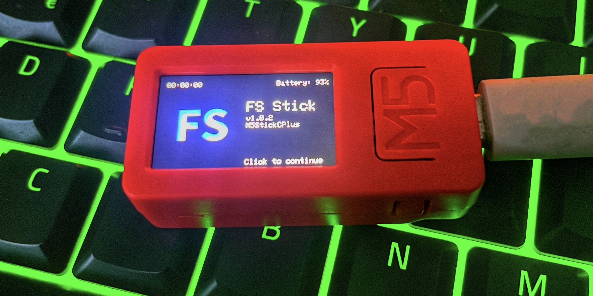

# 💫 fs stick

This is a simple project to play around with the [M5StickC Plus](https://m5stack.com/products/m5stickc-plus-esp32-pico-mini-iot-development-kit) trying to mimic a flipper zero functionality. I bought it cause i couldn't afford the flipper zero myself :c. This project is based on many different projects credited below. Even though the project is published, it is still a work in progress, and I will continue working on it for a while. Feel free to contribute and share your incredible ideas.

## ➰ Features (WIP)
* [o] IR Controller (TV, AC, etc)

* [o] Wifi Utilities (WIP)

* [x] Bluetooth Utilities (WIP)

* [x] Settings (WIP)

## 📦 How To Build
1. Clone the repo using `git clone https://github.com/IMXNOOBX/fstick.git`
2. Download the [Arduino IDE](https://www.arduino.cc/en/software) and install it or use visual studio code with the [Arduino extension](https://marketplace.visualstudio.com/items?itemName=vsciot-vscode.vscode-arduino)
3. Run the python script `python3 setup.py` to be able to to build the project
4. Go to the main file `fstick.ino` and click on the build button

## 📚 Credits

* [nemo](https://github.com/n0xa/m5stick-nemo) project for the idea and some code
* [SourApple](https://github.com/RapierXbox/ESP32-Sour-Apple) for the ble spammer
* [wifi-penetration-tool](https://github.com/risinek/esp32-wifi-penetration-tool) for incredible well documented code and such great tools